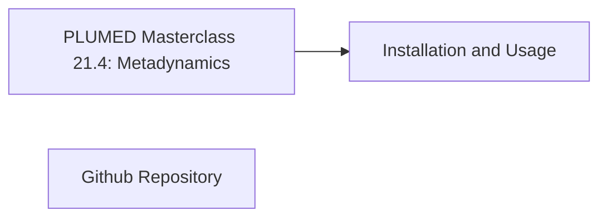

```mermaid
flowchart LR;
    A[PLUMED Masterclass 21.4: Metadynamics]-->B[Installation and Usage];
    C[Github Repository];

    click A "ref1" "You should understand the fundamentals of molecular dynamics simulations and complete this masterclass before moving on"
    click B "INSTRUCTIONS.md" "Instructions for installation, guided questions, and troubleshooting steps for this resource"
    click C "githublink" "Github Repository"
```