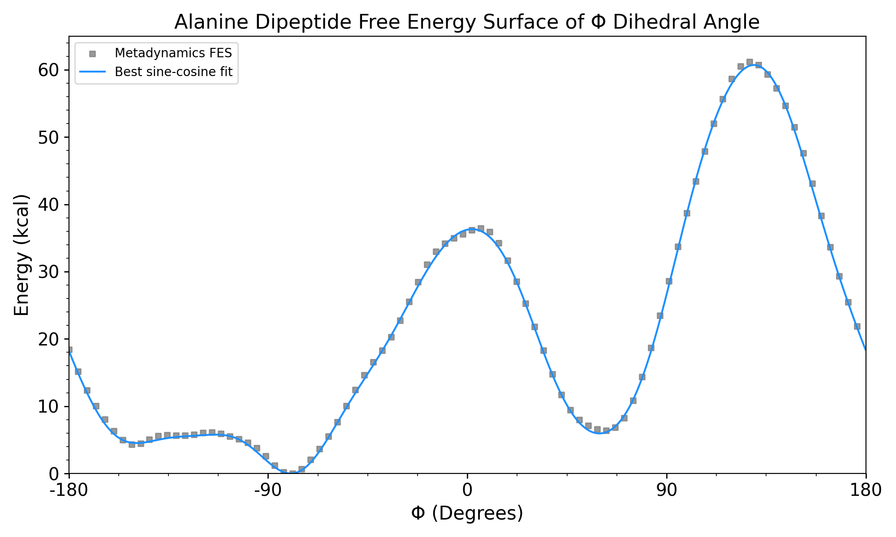

# VisMetaDynamics
An interactive tutorial to metadynamics and enhanced sampling techniques for molecular dynamics simulations.

# Introduction

VisMetaDynamics is a 1-dimensional Langevian integrator using a pre-defined free energy surface. This free energy surface is the result of a short MetaD simulation of alanine dipeptide, similar to this [tutorial](https://www.plumed.org/doc-v2.8/user-doc/html/lugano-3.html) and many others using alanine dipeptide as a toy system. The unmistakable, *a priori* free energy surface consistent alanine dipeptide's preference towards a trans configuration is an instantly recognizable and repeatedly proven result, both computationally and experimentally. 

When I was first learning how to use metadynamics, I struggled to visualize the effects these parameters had on the resulting free energy surface. Besides running several metadynamics simulations with slightly different parameters, there was no intuitive way to understand the effects these hyperparameters had on the reweighted free energy surface. VisMetaDynamics allows you to tune these parameters by hand with many options to visualize and compare simulations in seconds.

Users should try several combinations of parameters and explore the effects these parameters have on end results, simulation performance, and system behavior.

## <b> What/who is this resource for for? </b>
VisMetaDynamics is designed for someone already familiar with MD simulations. This tool is meant to augment [existing tutorials](http://www.plumed-tutorials.org/browse.html) and resources by offering a visual, qualitative understanding of the effect of hyperparameters on the resulting free energy surface and performance. Users are encouraged to play with these sliders and observe changes in simulation performance, accuracy of the free energy surface, and overall simulation behavior as a function of these parameters. 

# Installation
Using this tutorial is as simple as cloning the repo and running `python app.py`. This will automatically open up a Flask webpage on your default browser. The Python scripts are run locally and can be computationally intensive, depending on the parameters chosen and hardware. The ranges of the values on the sliders are chosen to allow the user to explore many combinations of parameters, but may result in <b>computationally intractable calculations</b>.

> [!NOTE]
>  This tutorial uses common libraries and has few dependencies, such as Scipy, Numpy, and Flask. `environment.yml` is included if needed. 

> [!NOTE]
> If the Flask webpage is not opening or showing a black screen, try running `python src/walker.py` to get the raw output of the integrator with the parameters from `src/config.py`
 

> [!CAUTION]
> Maximizing simulation steps and minimizing hill frequency is computationally expensive, explore at your own risk. 
 

# About

First described by [Laio and Parrinello][1] in 2002, metadynamics has proven to be useful in applications such as [drug discovery][2], [materials science][3], [ligand bindings][4], and [much more][5]. Since then, numerous versions of metadynamics have been designed to address the shortcomings of classical metadynamics; parallel-bias metadynamics, well-tempered metadynamics, and bias-exchange metadynamics are all flavors of the original 2002 paper. Metadynamics and all related acronyms can be applied easily to modern MD engines via plugins or built-in functions, making this family of enhanced sampling techinques widely accessible. A thorough review of the rigorously correct implementations and limitations for specific use cases of MetaD are beyond the scope of this resource, but users are encouraged to consult [documentation](https://www.plumed.org/) and [practical applications](https://www.plumed-nest.org/) on their own. 

Pictured below are stick representations of  *cis* (left) and *trans* (right) configurations of alanine dipeptide. The dihedral angle Φ corresponding to the two metastable states are also defined.  

    
     

In metadynamics, potential energy is added to a chosen collective variable (CV) periodically in the form of Gaussian kernels, or bias. This bias encourages the system to escape metastable states, allowing the system to  explore otherwise inaccessible conformations in the CV space. With carefully chosen CVs and parameters, rare events can be observed on timescales accessible by modern MD engines. To ensure adequate sampling and simulation performance, several parameters must be chosen.

$$
V_S(t) = t_0 \sum_{t'=\tau_G} W_0 \exp \left( - \frac{(S_i - S_i(t'))^2}{2\sigma_i^2} \right)
$$

Once the metadynamics simulation has converged, the underlying free energy surface of the chosen CV space can be visualized. The graph below shows the reweighted free energy surface of a real metadynamics simulation. Details to reproduce the results of this simulation can be found in `MD/`. The underlying potential of the integrator is a sine/cosine fit of this free energy surface. Understanding how the parameters in the sliders affect the method's ability to reproduce the underlying potential exactly is the primary goal of this tutorial. 

    

# Contributing 

# References
[1]: https://doi.org/10.1073/pnas.202427399
[2]: https://pubs.acs.org/doi/10.1021/acs.jmedchem.6b01642
[3]: https://doi.org/10.1038/nmat1696
[4]: https://pubs.acs.org/doi/full/10.1021/acs.jpcb.3c07972
[5]: https://doi.org/10.1088/0034-4885/71/12/126601

